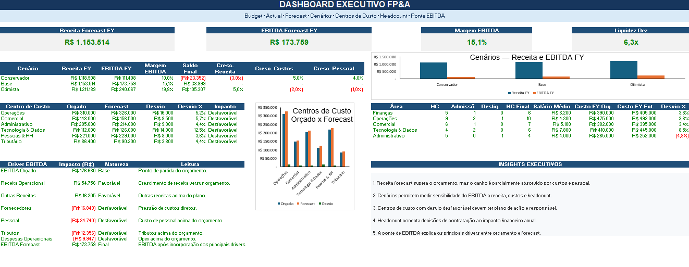
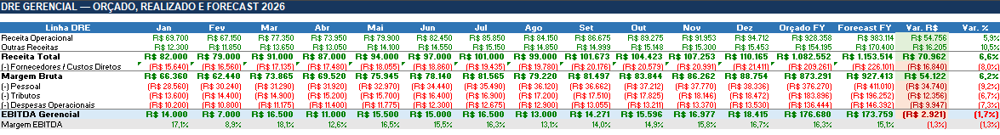
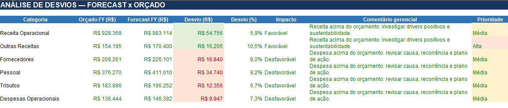
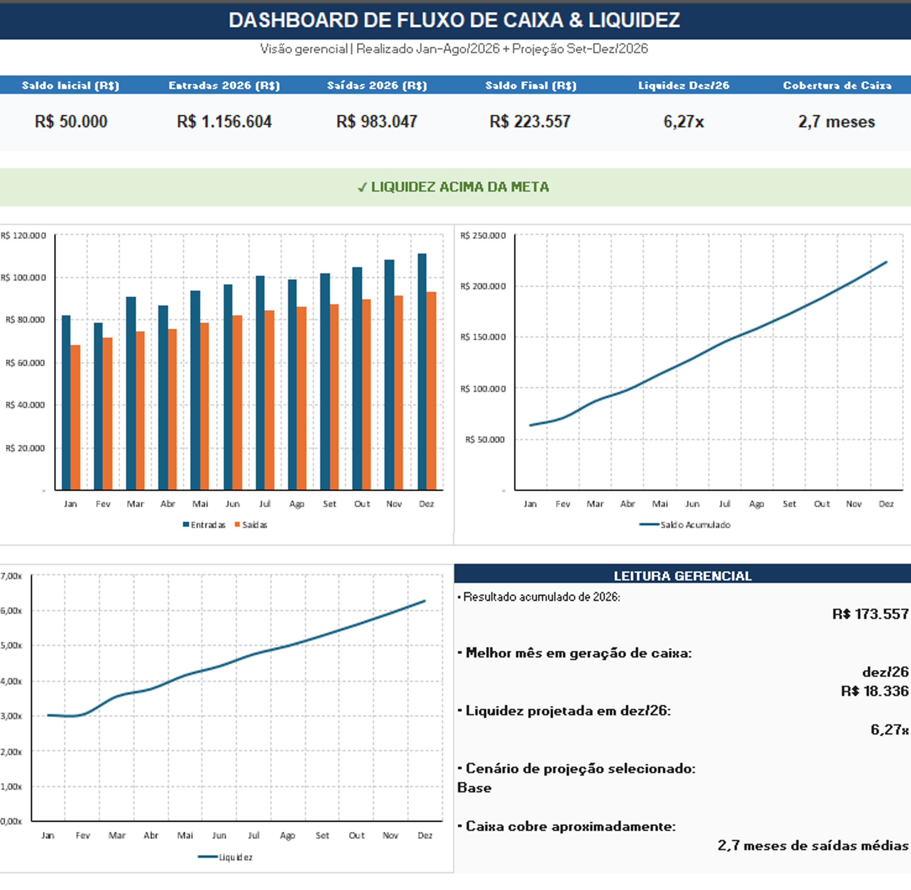

# 📊 FP&A | Financial Planning & Analysis

Projeto de **Planejamento e Análise Financeira (FP&A)** desenvolvido em Excel para simular uma rotina de acompanhamento financeiro, análise de performance e suporte à tomada de decisão.

O modelo integra **Budget, Actual e Forecast**, DRE Gerencial, Fluxo de Caixa, análise de desvios, indicadores de liquidez, centros de custo, headcount e análise de cenários.

> **Nota:** todos os dados utilizados neste projeto são fictícios e foram desenvolvidos exclusivamente para fins educacionais e de portfólio.

---

## 📊 Dashboard Executivo

O Dashboard Executivo consolida os principais indicadores financeiros do modelo, permitindo uma visão rápida da performance da empresa e de suas projeções.

Entre os principais KPIs analisados estão:

* Receita
* EBITDA
* Margem EBITDA
* Entradas e Saídas
* Saldo Acumulado
* Índice de Liquidez
* Budget vs Actual
* Forecast

---

## 🎯 Objetivo do Projeto

O objetivo foi desenvolver um modelo financeiro capaz de transformar dados contábeis e financeiros em **informações gerenciais para suporte à tomada de decisão**.

O modelo busca responder perguntas como:

* Como o realizado está performando em relação ao orçamento?
* Quais são os principais desvios de receitas e despesas?
* Quais fatores estão impactando o EBITDA?
* Como está a geração ou o consumo de caixa?
* Qual é a tendência financeira para os próximos meses?
* Como diferentes premissas impactam o resultado projetado?
* Quais centros de custo apresentam maiores desvios?
* Qual é o impacto do headcount sobre os custos da empresa?

---

## 💰 Budget vs Actual vs Forecast

O modelo utiliza três perspectivas para acompanhamento financeiro:

**Budget** — planejamento financeiro original do período.

**Actual** — valores efetivamente realizados.

**Forecast** — projeção atualizada considerando o desempenho realizado e as premissas para os períodos seguintes.

Essa estrutura permite acompanhar não apenas o que aconteceu, mas também **como o resultado esperado está evoluindo ao longo do período**.

---

## 📈 DRE Gerencial

A DRE Gerencial foi estruturada para acompanhar a evolução do resultado e comparar **Orçado, Realizado e Forecast**.

Entre os principais indicadores analisados estão:

* Receita
* Custos
* Despesas Operacionais
* EBITDA
* Margem EBITDA

A análise permite identificar os principais fatores responsáveis pela evolução do resultado financeiro.

---

## 🔎 Análise de Desvios

A análise de desvios compara o desempenho realizado com o planejamento e identifica o impacto das diferenças encontradas.

Os desvios são classificados de acordo com seu efeito sobre o resultado:

| Situação                    | Classificação |
| --------------------------- | ------------- |
| Receita acima do orçamento  | Favorável     |
| Receita abaixo do orçamento | Desfavorável  |
| Despesa abaixo do orçamento | Favorável     |
| Despesa acima do orçamento  | Desfavorável  |

Essa abordagem permite interpretar as variações considerando seu **impacto econômico**, e não apenas o sinal matemático da diferença.

---

## 💵 Fluxo de Caixa e Liquidez

O fluxo de caixa permite acompanhar:

* Entradas
* Saídas
* Resultado mensal
* Saldo acumulado
* Projeção de caixa
* Índice de liquidez
* Cobertura de caixa

### Liquidez Corrente

A capacidade de pagamento é acompanhada através do indicador:

**Liquidez Corrente = Ativo Circulante / Passivo Circulante**

Esse indicador auxilia na avaliação da capacidade da empresa de cumprir suas obrigações de curto prazo.

---

## 🏢 Análise por Centro de Custo

As despesas são analisadas também por **centro de custo**, permitindo identificar quais áreas apresentam maior consumo de recursos e quais concentram os principais desvios em relação ao planejamento.

Essa visão contribui para uma análise mais detalhada dos drivers de despesas da organização.

---

## 👥 Headcount

O modelo contempla a análise da evolução do quadro de colaboradores e seu impacto sobre as despesas com pessoal.

Essa visão permite relacionar decisões de contratação e estrutura organizacional com o planejamento financeiro e o Forecast.

---

## 📊 Análise de Cenários

Foram considerados três cenários financeiros:

* 🔻 Conservador
* ➖ Base
* 🔺 Otimista

As premissas permitem avaliar como alterações em receitas e despesas podem impactar os resultados projetados.

A análise de cenários auxilia na avaliação de riscos e na preparação para diferentes condições de negócio.

---

## 📉 EBITDA Bridge

O modelo também utiliza uma análise de ponte de EBITDA para demonstrar os principais fatores responsáveis pela diferença entre o resultado planejado e o resultado projetado.

Essa análise ajuda a transformar uma variação financeira em **drivers de negócio mais facilmente interpretáveis**.

---

## 🛠️ Ferramentas e Competências Aplicadas

### Microsoft Excel

* Modelagem financeira
* Fórmulas e funções
* Estruturação de bases
* Dashboards
* Indicadores financeiros
* Análise de variações
* Forecast
* Análise de cenários

### FP&A e Finanças Corporativas

* Budget
* Actual
* Forecast
* DRE Gerencial
* Fluxo de Caixa
* EBITDA
* Margem EBITDA
* Análise de Desvios
* Liquidez
* Headcount
* Centros de Custo
* Scenario Analysis

---

## 📂 Arquivo do Projeto

O modelo financeiro completo desenvolvido em Excel está disponível neste repositório:

**`FPA_Financial_Model.xlsx`**

---

## 💡 Principais Aprendizados

O desenvolvimento deste projeto permitiu integrar conceitos de **Contabilidade, Finanças Corporativas e Análise de Dados** em um único modelo financeiro.

Mais do que construir indicadores, o objetivo foi desenvolver uma visão gerencial dos números, conectando:

**Planejamento → Realizado → Análise de Desvios → Forecast → Tomada de Decisão**

---

## 🚀 Próximos Passos

Como evolução do projeto, poderão ser incorporados:

* Automatização da preparação dos dados com Power Query
* Integração com Power BI
* Novos indicadores de performance
* Forecast com premissas mais avançadas
* Análises adicionais por centro de custo
* Automatização de relatórios gerenciais

---

## 👩‍💼 Sobre o Projeto

Projeto desenvolvido para fins de estudo e portfólio profissional nas áreas de **FP&A, Finanças Corporativas, Controladoria e Dados**.

Todos os dados e valores apresentados são fictícios.
